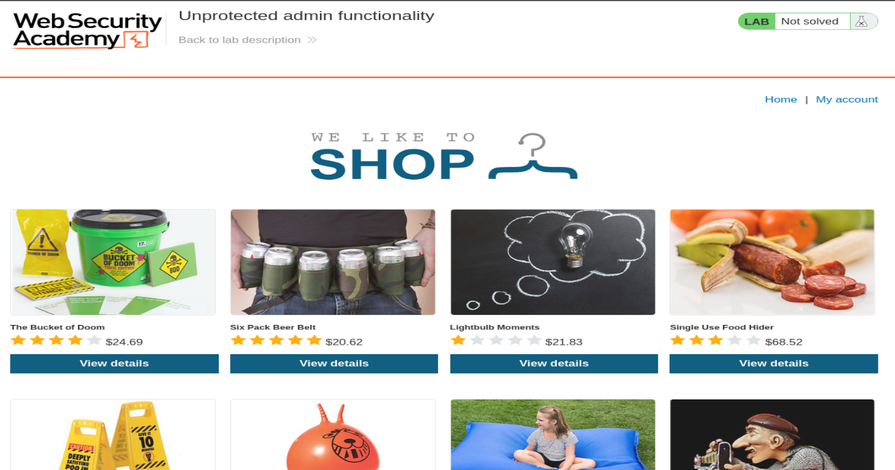
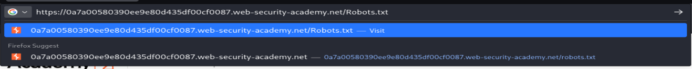
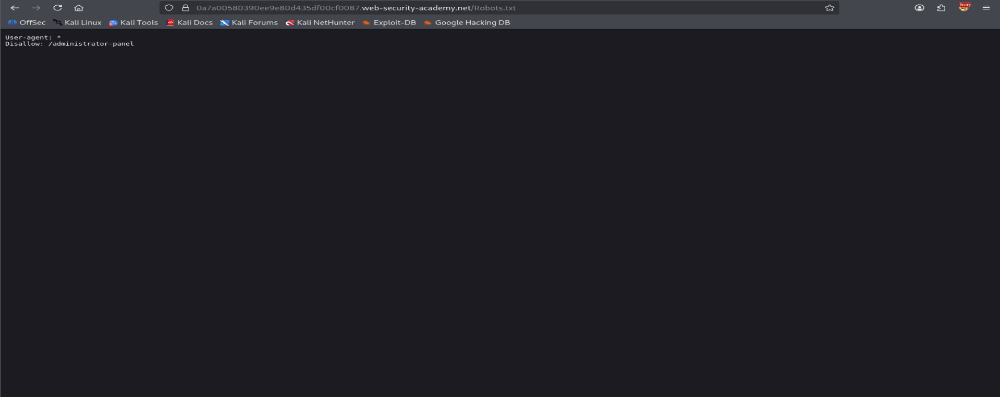
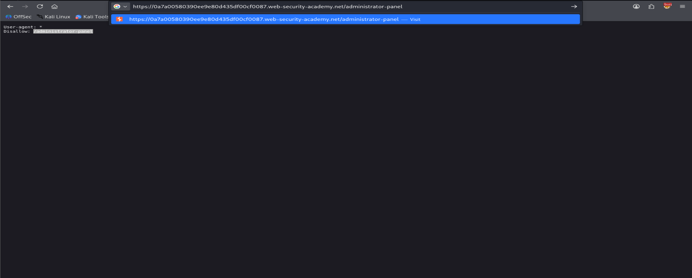
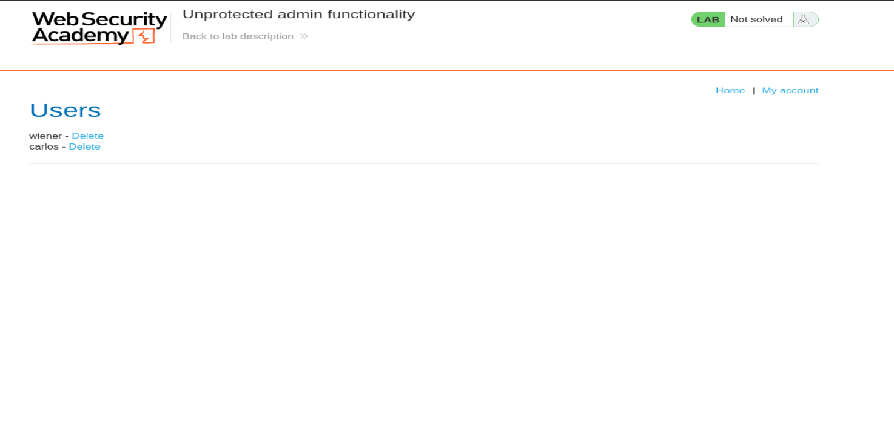
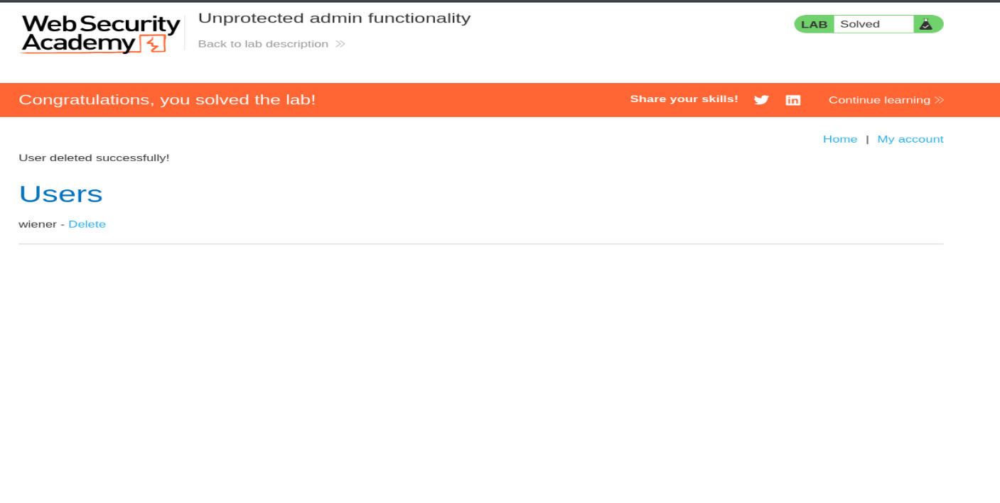

# Unprotected Admin Functionality

**Source:** PortSwigger Web Security Academy <br>
**Category:** Access Control <br>
**Difficulty:** Apprentice <br>

## Objective

Identify an admin panel that has no access control protecting it, and use it to delete a user (`carlos`) to solve the lab.

## Environment / Setup

- Target: PortSwigger-hosted lab instance (`*.web-security-academy.net`)
- Tools: Firefox / browser address bar only (no proxy or scanner needed for this lab)

## Vulnerability

**Broken Access Control — security through obscurity.**

The application assumes that hiding the admin panel URL is enough to protect it. Instead of checking the logged-in user's role/session before granting access to admin functions, it relies on the URL simply not being publicly linked anywhere on the site. This is not real access control — anyone who discovers or guesses the URL can reach it directly, authenticated or not.

A common way this URL gets leaked is through `robots.txt`, which is meant to tell search engine crawlers which paths *not* to index — but ironically, this often reveals the exact paths an attacker is looking for.

## Steps to Reproduce

**1. Load the application homepage**

Standard e-commerce shop front, nothing unusual visible — no visible link to an admin panel anywhere on the page.



**2. Check `robots.txt` for disallowed/hidden paths**

Navigated to `/robots.txt`.



**3. `robots.txt` discloses the hidden admin path**

The file explicitly disallows crawling of `/administrator-panel` — which confirms the path exists and tells us exactly where to look.

```
User-agent: *
Disallow: /administrator-panel
```



**4. Navigate directly to the disclosed path**

Went straight to `/administrator-panel` with no prior authentication as an admin.



**5. Admin panel loads with zero access control**

The panel loads fully and lists all users (`wiener`, `carlos`) with a **Delete** action next to each — no login, role check, or permission validation was performed.



**6. Delete `carlos` to solve the lab**

Clicked **Delete** next to `carlos`. The app confirms deletion and the lab is marked solved.



## Payload / PoC

No payload required — this is a pure access-control flaw. The "exploit" is simply:

```
GET /robots.txt
GET /administrator-panel
```

followed by clicking **Delete** on the target user.

## Impact

- **Confidentiality:** Any unauthenticated user can view the full user list.
- **Integrity:** Any unauthenticated user can delete arbitrary user accounts (or perform other exposed admin actions), with no audit trail tied to a legitimate admin identity.
- **Severity:** High — this is a complete authorization bypass. In a real deployment this could mean full account takeover of the admin panel's capabilities by anyone who finds the URL.
