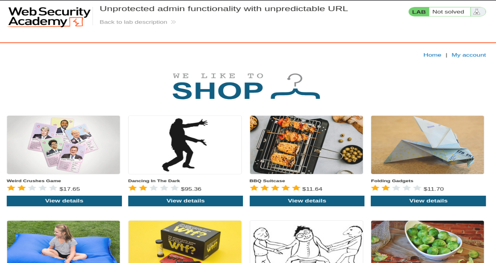
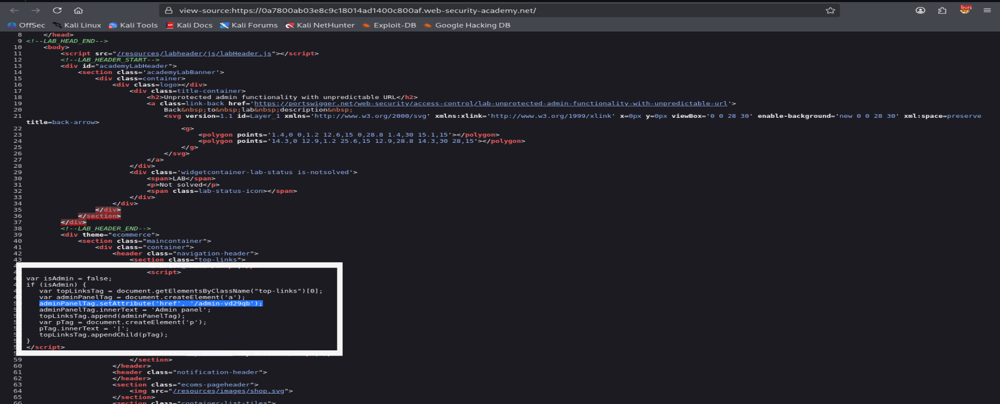
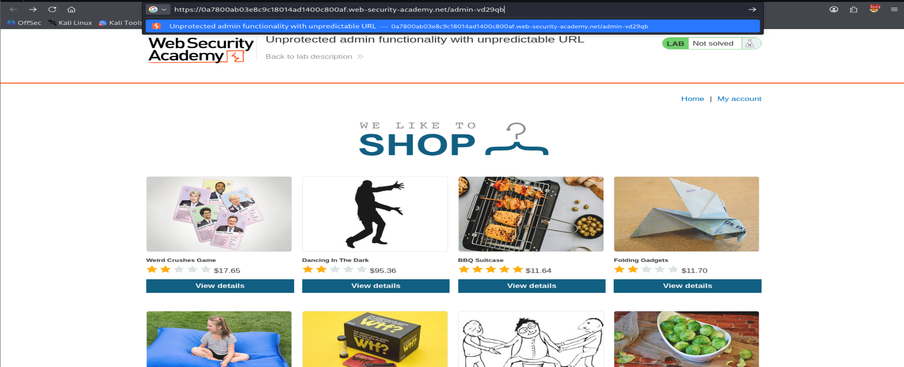
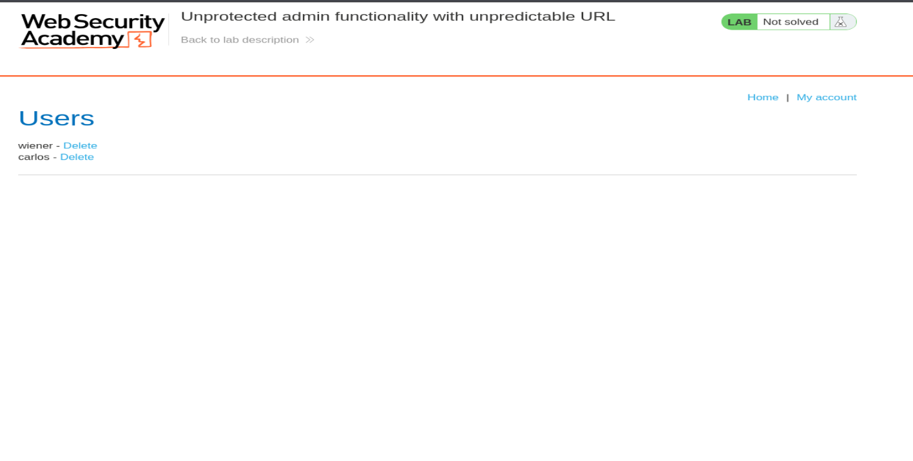
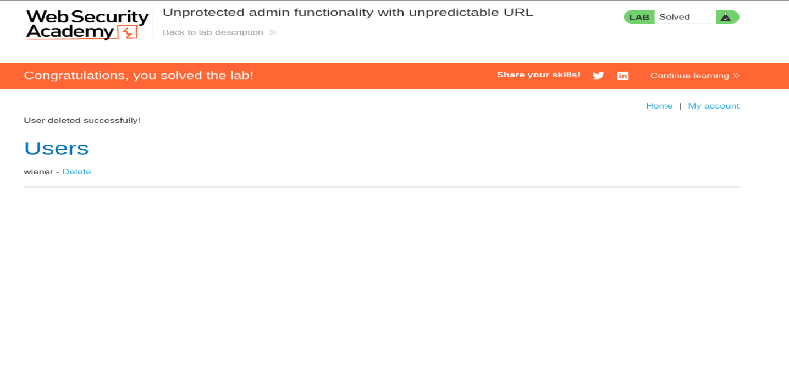

# PortSwigger Web Security Academy — Unprotected Admin Functionality with Unpredictable URL

**Category:** Access Control
**Lab:** [Unprotected admin functionality with unpredictable URL](https://portswigger.net/web-security/access-control/lab-unprotected-admin-functionality-with-unpredictable-url)

## Objective

The lab has an unprotected admin panel. Unlike a simpler variant of this lab, the URL isn't guessable (e.g. `/admin`) — it's randomized. The goal is to locate the actual admin panel URL and use it to delete the user `carlos`.

## Steps

### 1. Recon the home page

Loaded the shop home page as a normal, unauthenticated user.



Nothing on the page itself hints at an admin panel — no visible link in the nav bar.

### 2. Check the page source for hidden references

Since the admin link isn't rendered in the UI, the next step was to view the page source (`view-source:`) to check if the client-side JavaScript reveals the panel's path.



Found an inline `<script>` block:

```javascript
var isAdmin = false;
if (isAdmin) {
    var topLinksTag = document.getElementsByClassName("top-links")[0];
    var adminPanelTag = document.createElement('a');
    adminPanelTag.setAttribute('href', '/admin-vd29qb');
    adminPanelTag.innerText = 'Admin panel';
    topLinksTag.append(adminPanelTag);
    var pTag = document.createElement('p');
    pTag.innerText = '|';
    topLinksTag.appendChild(pTag);
}
</script>
```

The application only *renders* the admin link in the nav bar if `isAdmin` is `true` on the client side. Since this check happens in JavaScript (client-side), the actual admin panel URL — `/admin-vd29qb` — is shipped to every visitor regardless of role, whether or not the link is displayed. This is the core flaw: control over visibility ≠ control over access. The URL is "unpredictable" (randomized per lab instance) but still leaks in the page source.

### 3. Navigate directly to the leaked admin URL

Manually browsed to the disclosed path:

```
https://<lab-id>.web-security-academy.net/admin-vd29qb
```



### 4. Access granted — admin panel loads

No authentication or authorization check is performed on the server for this endpoint. The panel loads directly, exposing user management functionality.



The panel lists all users (`wiener`, `carlos`) with a **Delete** action next to each.

### 5. Delete `carlos` to solve the lab

Clicked **Delete** next to `carlos`.



Server responded with `User deleted successfully!` and the lab status flipped to **Solved**.

## Root Cause

Access control was enforced entirely on the client side via a JavaScript conditional (`isAdmin`). The server:
- Never validates the user's role before serving the `/admin-*` panel.
- Ships the admin URL to all clients in the page source regardless of whether the link is displayed.

Obscuring a URL (security through obscurity) is not a substitute for genuine server-side authorization checks.

## Remediation

- Enforce authentication and role-based authorization checks **server-side** on every request to admin/privileged endpoints — never rely on hiding a link or trusting a client-side flag.
- Do not embed sensitive endpoint paths or role-gating logic in client-deliverable JavaScript.
- Apply the principle of least privilege: verify the requesting user's session/role has explicit admin privileges before returning any admin-panel content or performing privileged actions (e.g. delete user).
