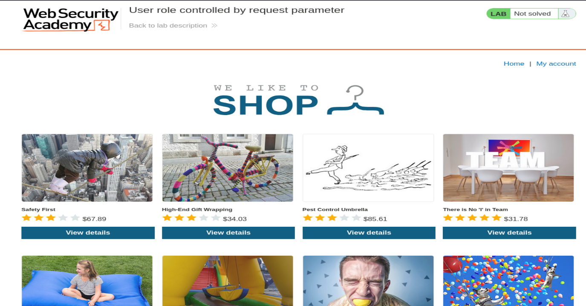
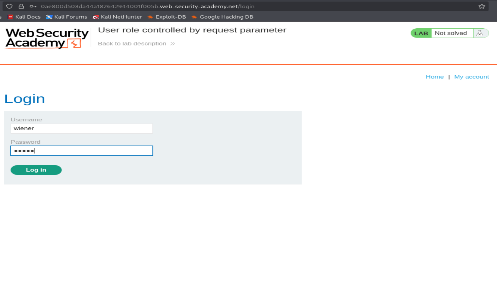
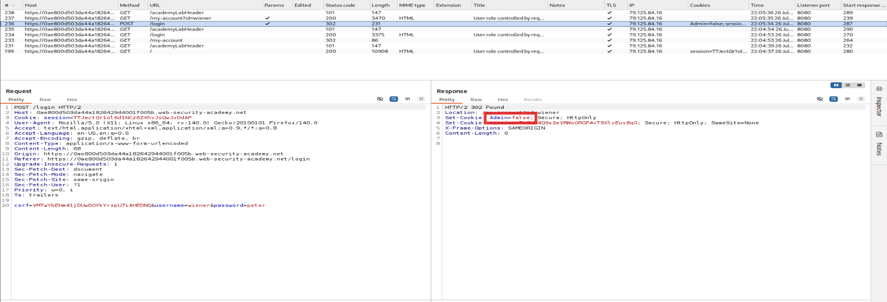
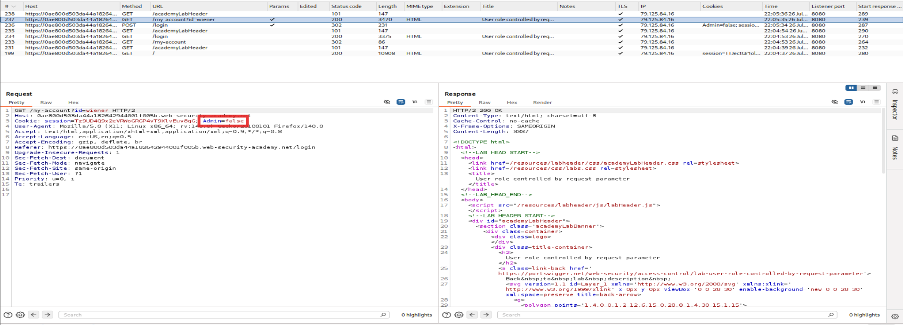
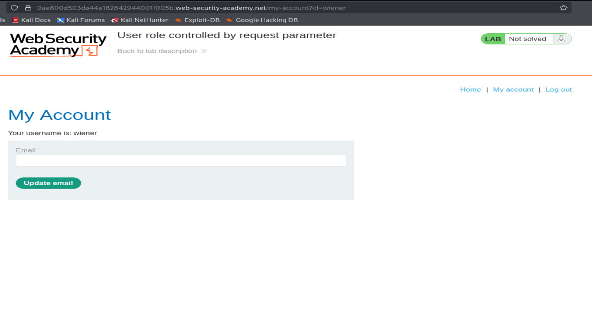
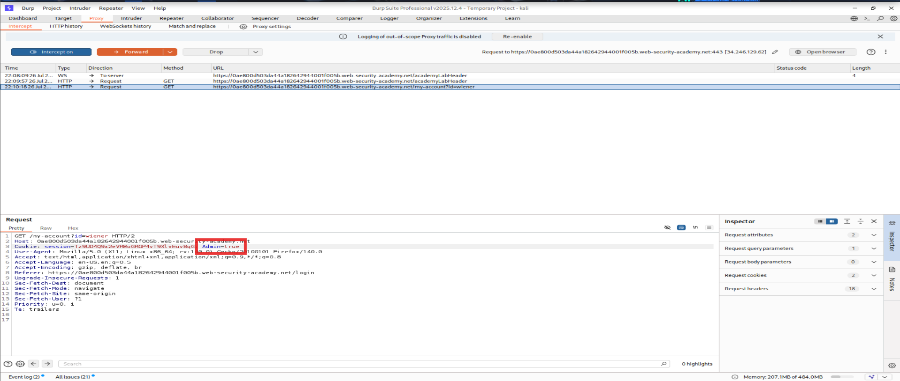
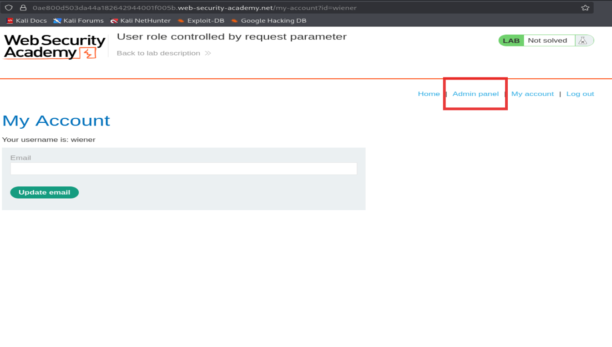
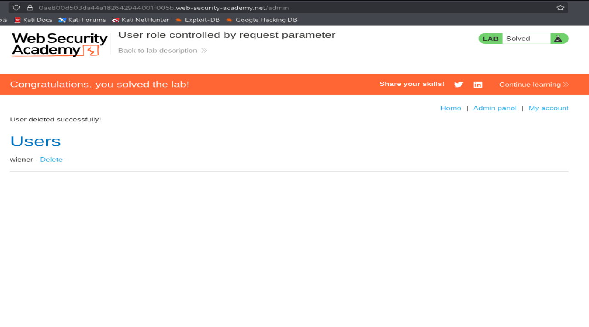

# PortSwigger Lab: User Role Controlled by Request Parameter

**Category:** Access Control
**Difficulty:** Apprentice
**Lab link:** https://portswigger.net/web-security/access-control/lab-user-role-controlled-by-request-parameter

## Objective

Log in using the provided low-privileged credentials, and access the admin
panel at `/admin` to delete the user `carlos`.

## Vulnerability

The application determines whether a logged-in user is an administrator
based on an `Admin` cookie that is sent to the client after login. Since
this trust decision is made client-side (via a cookie the browser controls),
an attacker can simply modify the cookie value to escalate their privileges
— a classic broken access control flaw.

## Interface

The first look of the website is as follow:



## Steps

### 1. Log in with the low-privileged account

Navigating to My account and Logging in with the provided credentials (`wiener:peter`) on the login page.



### 2. Intercept the login response in Burp Suite

Watching the traffic in Burp's HTTP history, the `POST /login` request
returns a `302 Found` response that sets two cookies:

```
Set-Cookie: Admin=false; Secure; HttpOnly
Set-Cookie: session=...; Secure; HttpOnly; SameSite=None
```

The `Admin=false` cookie immediately stands out — the server is trusting
the client to hold and return this role flag.



### 3. Confirm the cookie is echoed back on every request

Navigating to `/my-account?id=wiener`, the browser dutifully sends
`Admin=false` back in the `Cookie` header on every subsequent request.
This confirms the flag is stored purely client-side and isn't being
re-validated or signed by the server.



The resulting account page shows no admin functionality for the
`wiener` user, as expected.



### 4. Modify the cookie value

Using Burp Proxy's intercept feature, the `Admin` cookie was changed from
`false` to `true` on the request to `/my-account?id=wiener`, with intercept
set to modify every follow-up request the same way.



### 5. Reload the account page

After forwarding the modified request, the My Account page now displays an
**Admin panel** link that was previously hidden — the server accepted the
tampered cookie as proof of admin privilege.



### 6. Access the admin panel and delete the target user

Navigating to `/admin` confirmed access to the admin panel, listing all
users. Clicking **Delete** next to `carlos` (the lab's target user)
completed the objective.



## Root Cause

The server trusts a client-controlled cookie (`Admin`) as the sole
authority for authorization decisions, instead of deriving the user's role
server-side from an authenticated, tamper-proof source (e.g. a database
lookup keyed on the session). Because the cookie isn't signed, encrypted,
or validated against server-side state, any value the client sends is
accepted at face value.

## Fix / Recommendation

- Never make authorization decisions based on client-supplied parameters
  (cookies, hidden fields, query params) that the user can freely modify.
- Store role/permission data server-side, tied to the authenticated
  session, and re-check it on every privileged request.
- If role state must travel via a cookie, cryptographically sign it (and
  verify the signature server-side) so tampering is detectable — though
  the better fix is to avoid trusting client input for authorization at
  all.

## Result

**Lab solved** — privilege escalation achieved by modifying the `Admin`
cookie from `false` to `true`, granting access to `/admin` and allowing
deletion of the `carlos` user account.
