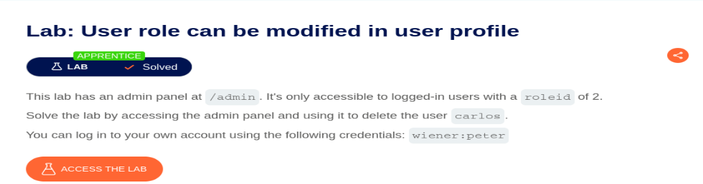
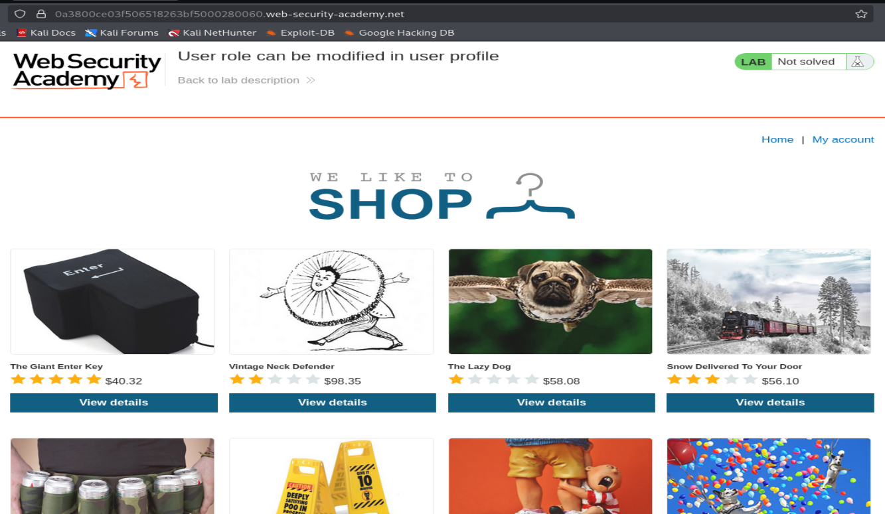
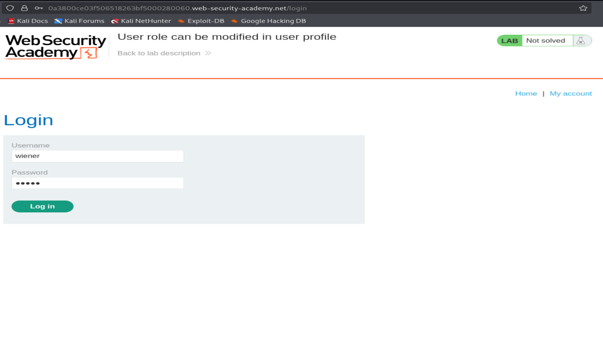
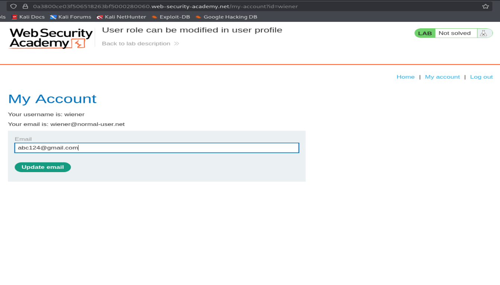
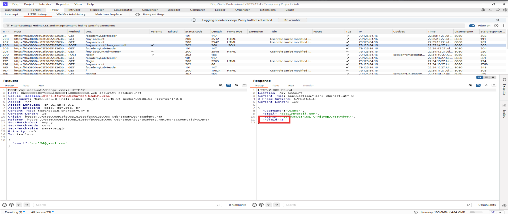
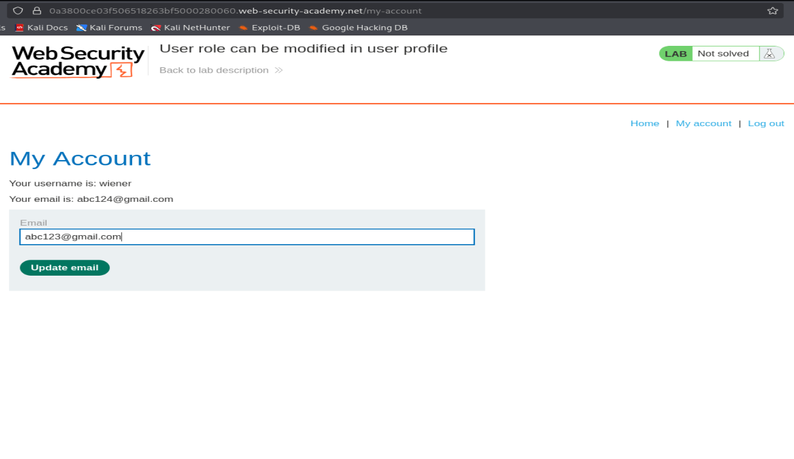
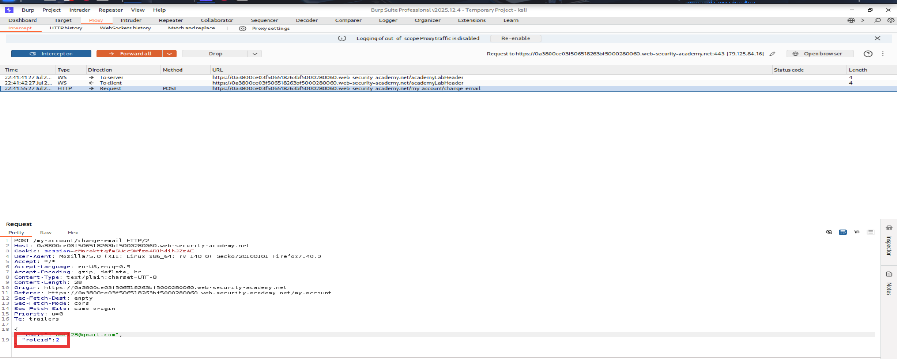
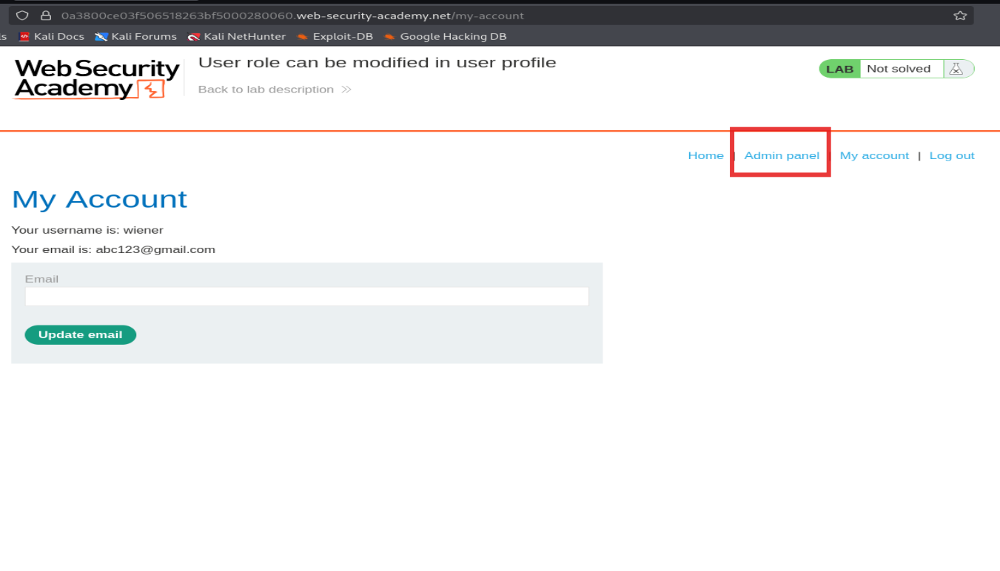
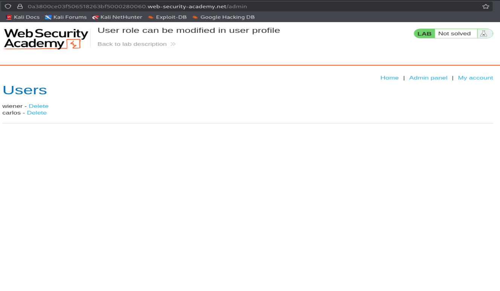
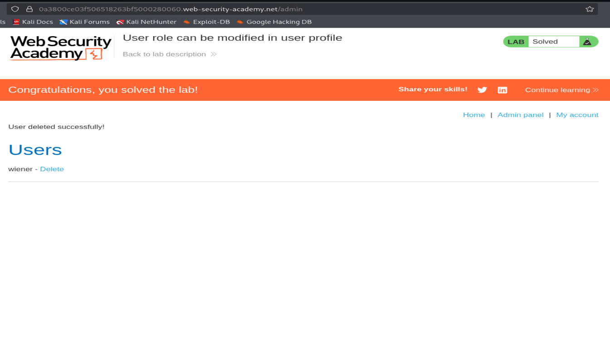

# PortSwigger Lab Writeup: User Role Can Be Modified in User Profile

**Category:** Broken Access Control <br>
**Difficulty:** Apprentice <br>

---

## Lab Description

This lab has an admin panel at `/admin`, only accessible to logged-in users with a `roleid` of `2`. The goal is to access the admin panel and use it to delete the user `carlos`.

Provided credentials: `wiener:peter`



---

## Step 1 — Explore the Application

Accessed the lab and landed on the standard "We Like To Shop" storefront.



---

## Step 2 — Log In

Logged in using the provided low-privilege credentials `wiener:peter`.



---

## Step 3 — Inspect the My Account Page

After logging in, Change Email Address through the given update Email functionality, which allows updating the account email address. Nothing here hints at a `roleid` yet — this is just the surface-level functionality.



---

## Step 4 — Intercept the Email Update Request in Burp

With Burp Suite's proxy history open, I updated the email and reviewed the `POST /my-account/change-email` request/response pair.

The **response** to this request leaked more than expected — it returned the full user object as JSON, including a field that was never sent in the request:

```json
{
  "username": "wiener",
  "email": "abc124@gmail.com",
  "apikey": "e6xbXNDcIhQOLTC4NjB4gLCYeIwnbRRr",
  "roleid": 1
}
```

This is the key finding: the server discloses a `roleid` parameter tied to the user's privilege level, even though the client never submitted one. This strongly suggests the same field can be *sent* in the request to influence the account's role — a classic case of trusting client-controllable input for access control.



---

## Step 5 — Confirm the Field Isn't Normally Sent

Back in the browser, updated the email again normally, confirming the request body only contains the `email` field — no `roleid` is sent by the front end.



---

## Step 6 — Tamper with the Request

Turned on Burp's Intercept and submitted another email update. Intercepted the raw `POST /my-account/change-email` request, and manually appended the `roleid` parameter to the JSON body:

```
POST /my-account/change-email HTTP/2
Host: <lab-id>.web-security-academy.net
Cookie: session=...
Content-Type: text/plain;charset=UTF-8

{
  "email":"abc123@gmail.com",
  "roleid":2
}
```

Since the backend already had a `roleid` field defined on the user object (as revealed in the earlier response) and there was no server-side check preventing the client from setting it directly, forwarding this modified request should promote the account.



---

## Step 7 — Verify Privilege Escalation

Forwarded the tampered request. Reloading `My Account` now shows a new **Admin panel** link in the navigation bar — confirming the account's role was successfully escalated from `roleid: 1` to `roleid: 2`.



---

## Step 8 — Access the Admin Panel

Navigated to `/admin`, which is now accessible. It lists all users with delete controls, including the target user `carlos`.



---

## Step 9 — Delete Carlos

Clicked **Delete** next to `carlos`. The application confirmed the deletion and the lab was marked as solved.



---

## Impact

Any authenticated user can escalate their own privileges to admin (or any other role) simply by adding an extra field to a legitimate request, leading to full account/data compromise — in this case, arbitrary user deletion via the admin panel.

## Remediation

- **Never bind client-supplied JSON directly to internal data models.** Use an explicit allow-list of updatable fields (e.g., only `email`) per endpoint.
- **Enforce server-side authorization checks** on role/privilege changes — role should never be settable by the user themselves.
- **Minimize data exposure in API responses** — don't return internal/sensitive fields (`roleid`, `apikey`) that the client-side UI doesn't actually need.
- Treat any user-modifiable object as untrusted input, regardless of which fields the front end intends to send.
