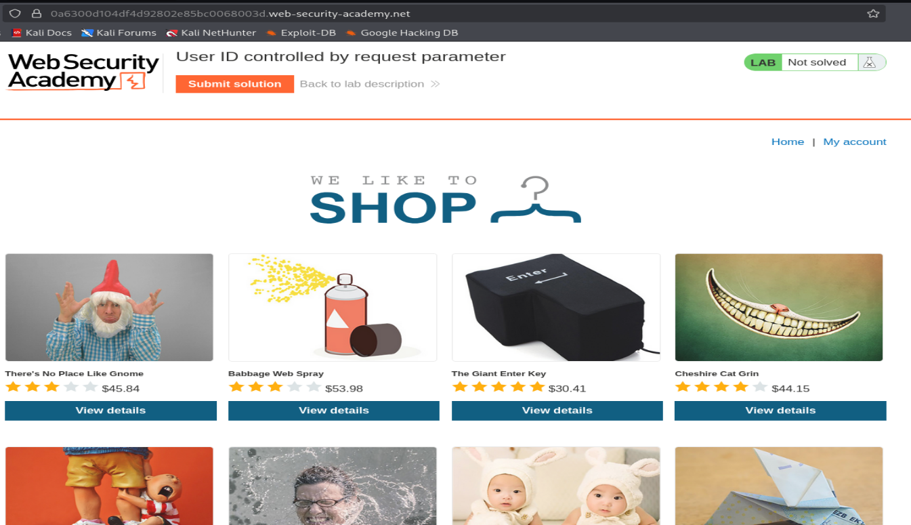
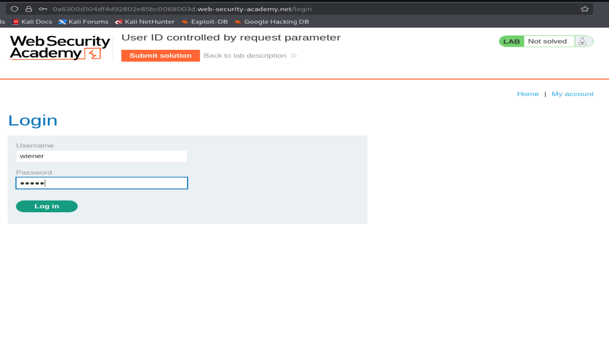
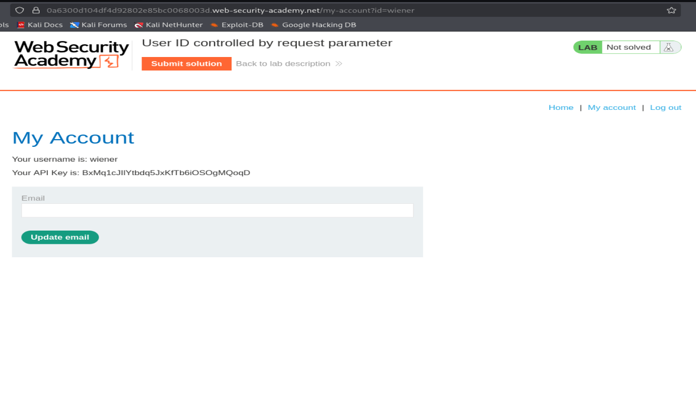
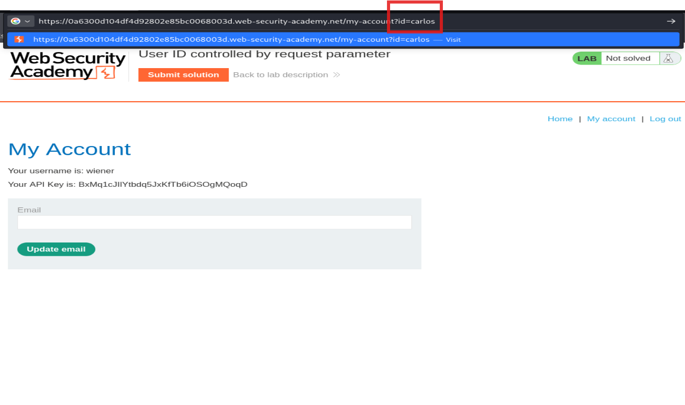
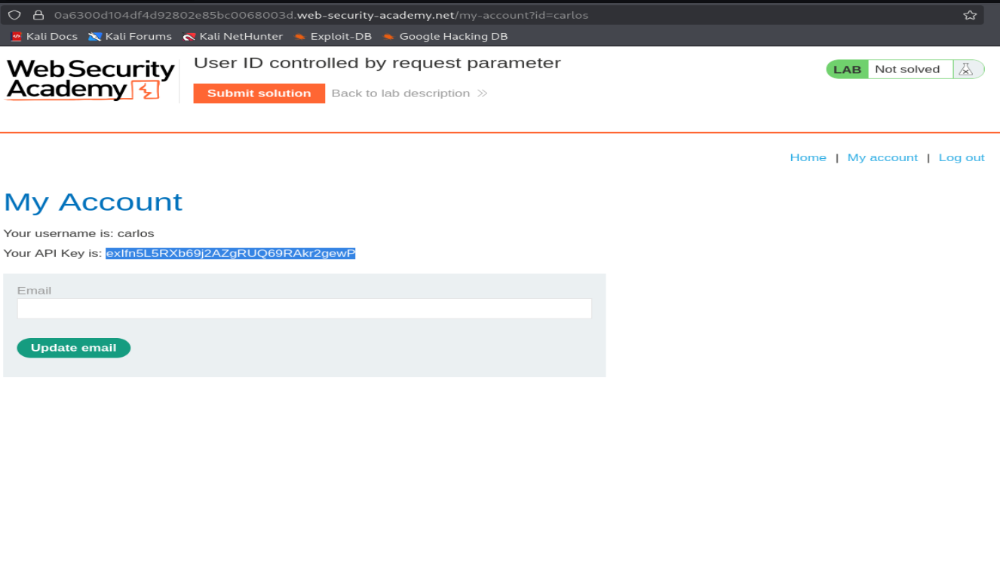
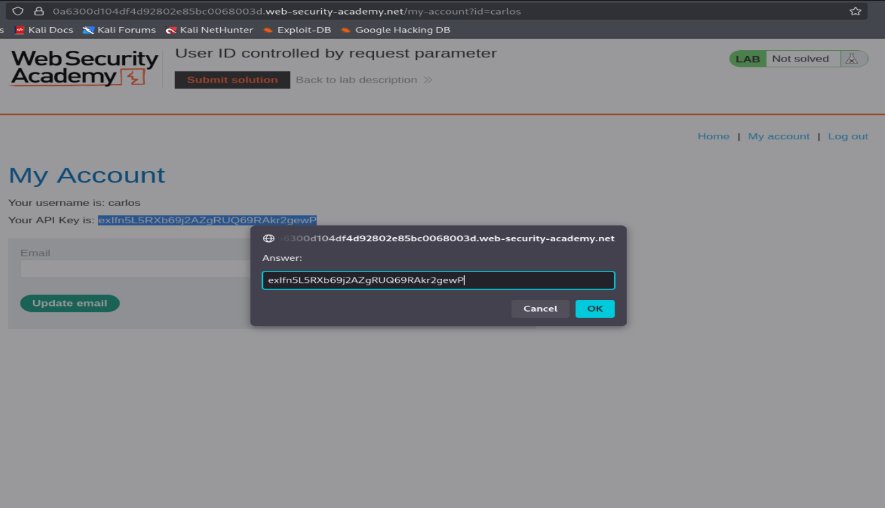
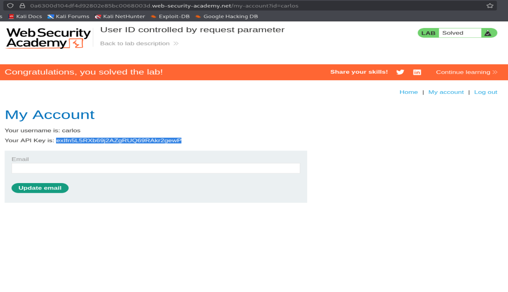

# PortSwigger Lab Writeup: User ID Controlled by Request Parameter

**Category:** Broken Access Control (IDOR) <br>
**Difficulty:** Apprentice

---

## What's the Bug?

The account page loads user data based on an `id` parameter in the URL — like `my-account?id=wiener`. The app never checks if the logged-in user is actually allowed to view that `id`. So if I change it to someone else's username, it just shows me their data instead. This is a classic **IDOR (Insecure Direct Object Reference)**.

---

## Step 1 — Open the Lab

Started at the shop homepage.



---

## Step 2 — Log In

Logged in with the given credentials `wiener:peter`.



---

## Step 3 — Check the Account Page

After logging in, the URL looked like this:

```
/my-account?id=wiener
```

The page shows my username and my API key. Notice the `id=wiener` sitting right there in the URL, fully editable.



---

## Step 4 — Change the `id` Parameter

Just edited the URL, swapping `wiener` for the target username `carlos`:

```
/my-account?id=carlos
```



---

## Step 5 — Access Carlos's Account

The page loaded fine and now shows **carlos's** username and his private API key — no authorization check stopped it.



---

## Step 6 — Submit the Leaked API Key

Copied carlos's API key and pasted it into the "Submit solution" prompt to prove the exploit.



---

## Step 7 — Lab Solved

The lab confirmed the solution was correct.



---

## Why This Happens

The server trusts the `id` value coming from the client without checking whether it belongs to the logged-in user. So any user can view (or sometimes modify) another user's data just by changing a parameter — no hacking skills needed beyond noticing the URL.

## How to Fix It

- Never rely on client-supplied IDs to decide what data to return.
- On every request, check server-side that the requested `id` actually belongs to the logged-in session — not just that the user is logged in at all.
- Prefer using the session/user context to fetch "my data" instead of trusting a parameter for it.
