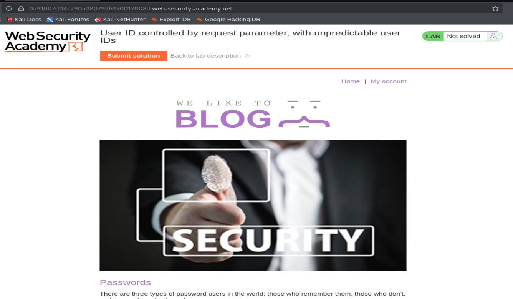
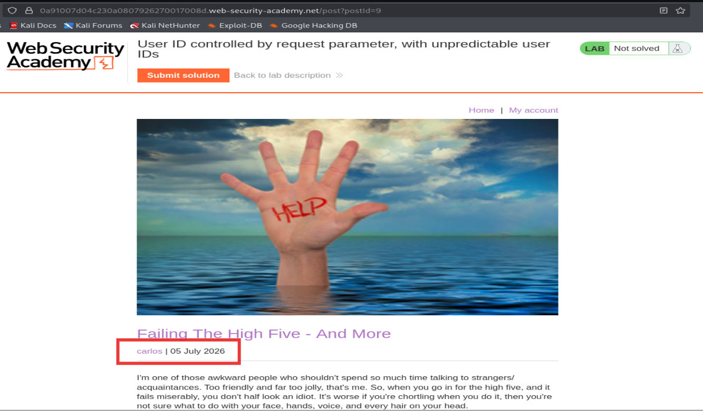
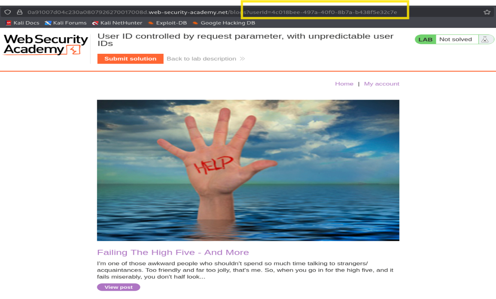
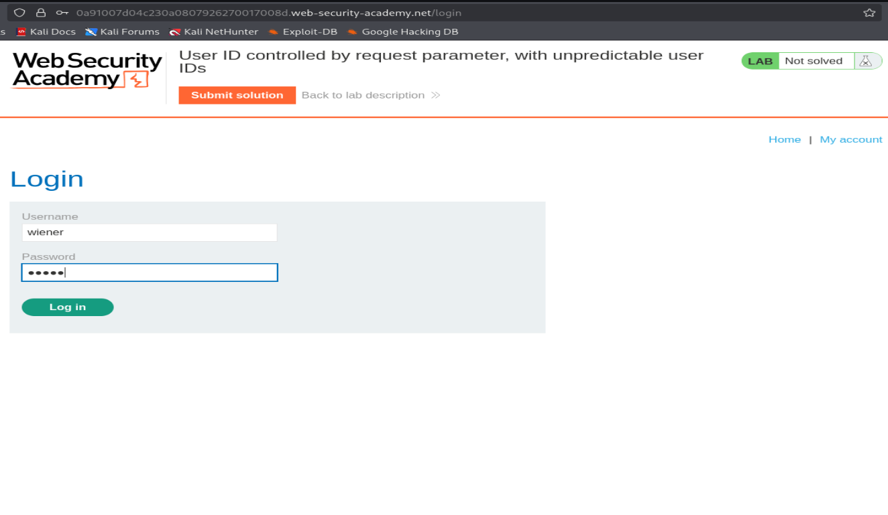
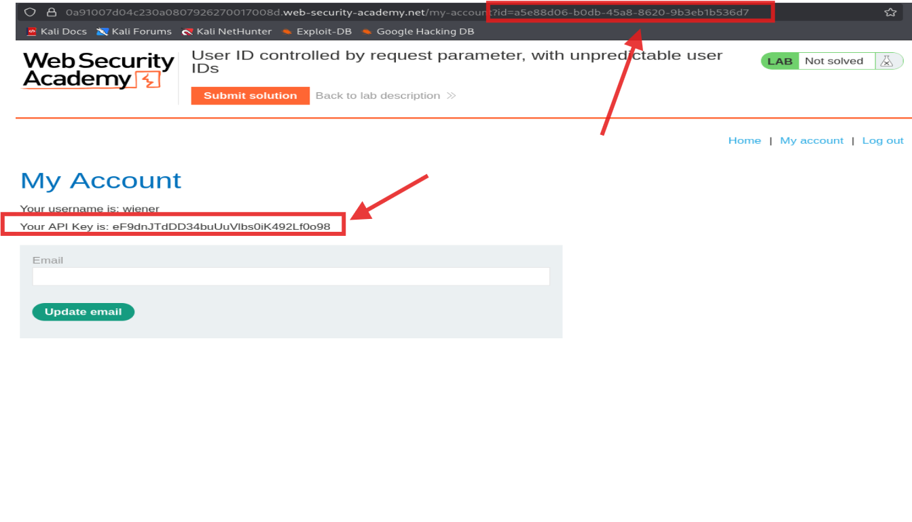
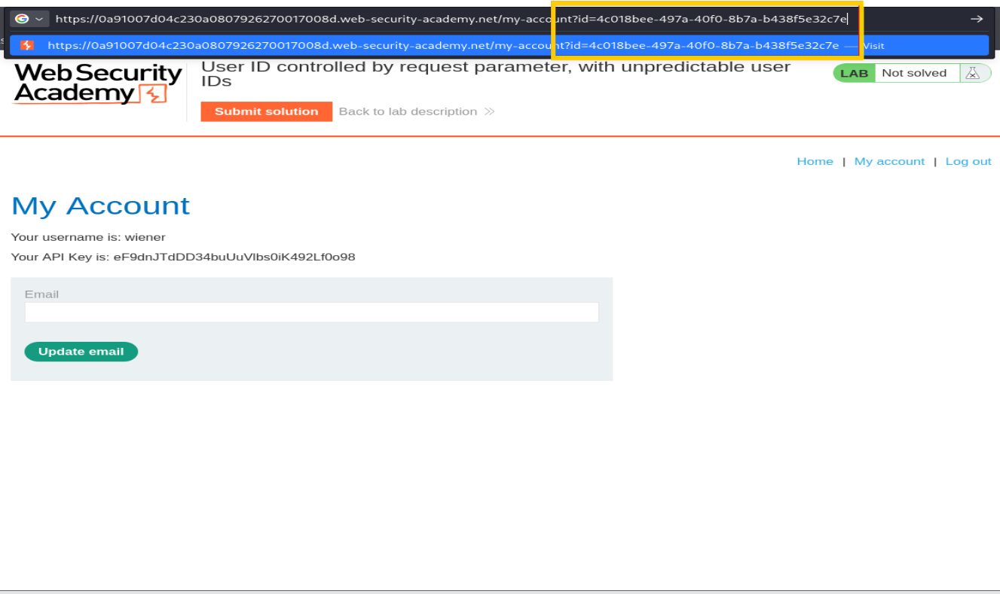
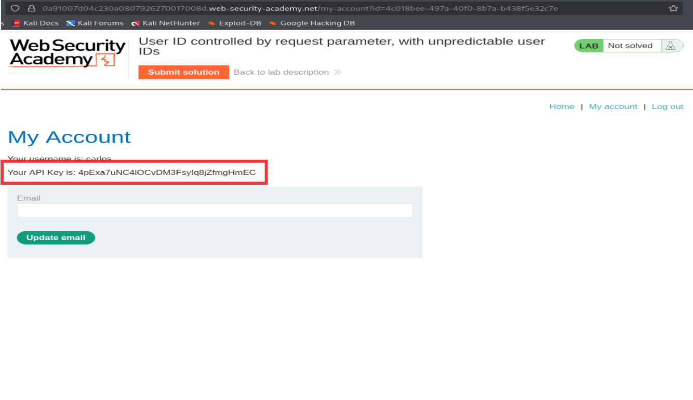
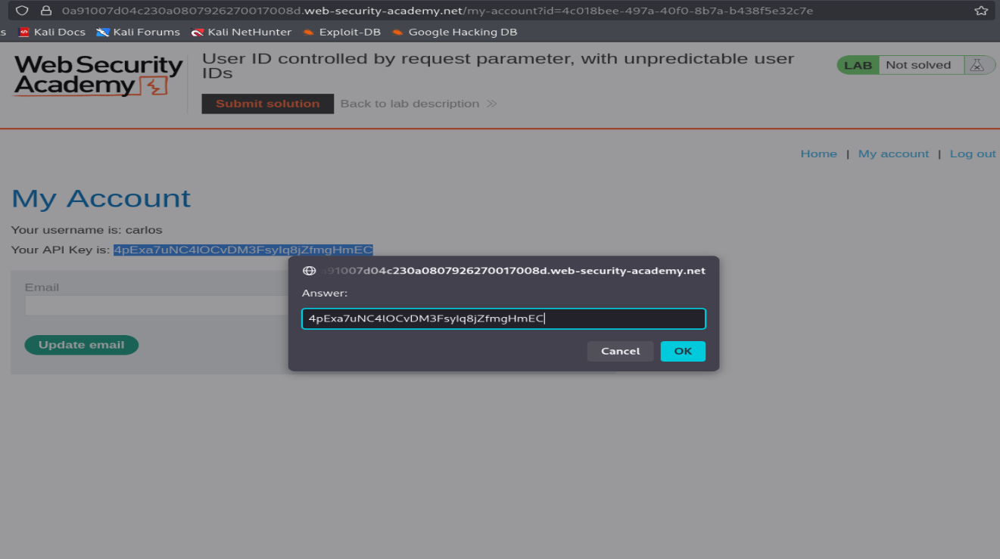
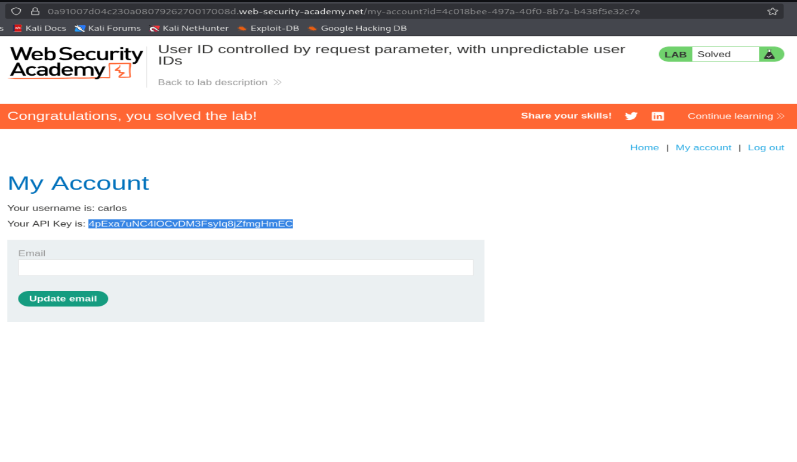

# PortSwigger Lab Writeup: User ID Controlled by Request Parameter (Unpredictable User IDs)

**Category:** Broken Access Control (IDOR) <br>
**Difficulty:** Practitioner <br>

---

## What's the Bug?

In this lab `my-account?id=...` loads data based on an `id` in the URL. This time the `id` is a random **UUID**, not a guessable username — so I can't just type `carlos` in the URL. But the app leaks other users' UUIDs elsewhere on the site, so I just need to find one.

---

## Step 1 — Browse the Blog

Opened the blog homepage on the site.



---

## Step 2 — Find a Post by Carlos

Opened a blog post (`post?postId=9`) and noticed the author name **carlos** is a clickable link.



---

## Step 3 — Click Carlos's Name to Leak His UUID

Clicking on **carlos** took me to `/blogs?userId=4c018bee-497a-40f0-8b7a-b438f5e32c7e` — this is Carlos's real user ID, leaked right in the URL.



---

## Step 4 — Log In

Logged in as `wiener:peter`.



---

## Step 5 — Check My Own Account

After logging in, my account page shows my own UUID (`id=a5e88d06-...`) and my own API key.



---

## Step 6 — Swap My UUID for Carlos's

Edited the URL, replacing my `id` with the UUID I grabbed from the blog page:

```
/my-account?id=4c018bee-497a-40f0-8b7a-b438f5e32c7e
```



---

## Step 7 — Carlos's Account Loads

The page now shows **carlos's** username and his private API key — the server still doesn't check ownership, it just trusts whatever `id` is passed.



---

## Step 8 — Submit the Leaked API Key

Copied carlos's API key and submitted it as the solution.



---

## Step 9 — Lab Solved

Confirmed correct.



---

## Why This Happens

Making the ID a random UUID instead of a username *looks* safer, but it doesn't actually fix anything — the server still never checks whether the requested `id` belongs to the logged-in user. The only real protection was "the ID is hard to guess," and that broke the moment the UUID was exposed somewhere else on the site (the blog author link).

## How to Fix It

- Don't rely on IDs being hard to guess as a security control — always verify ownership server-side.
- Avoid leaking one user's identifiers (UUIDs, keys, etc.) to another user through unrelated pages like blog posts.
- Check that the session owns the resource being requested, regardless of how unpredictable the ID looks.
