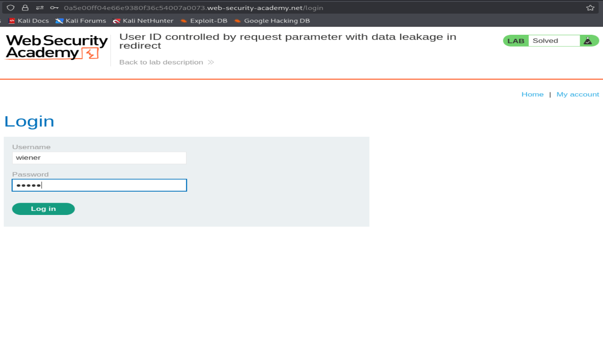
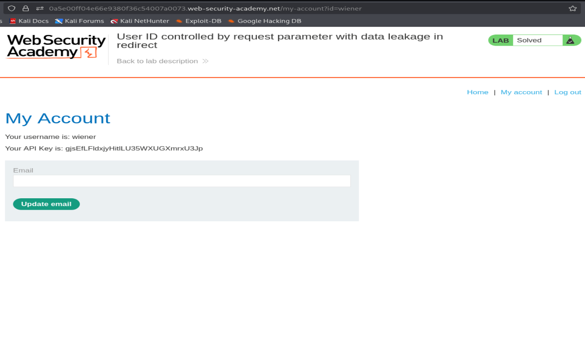
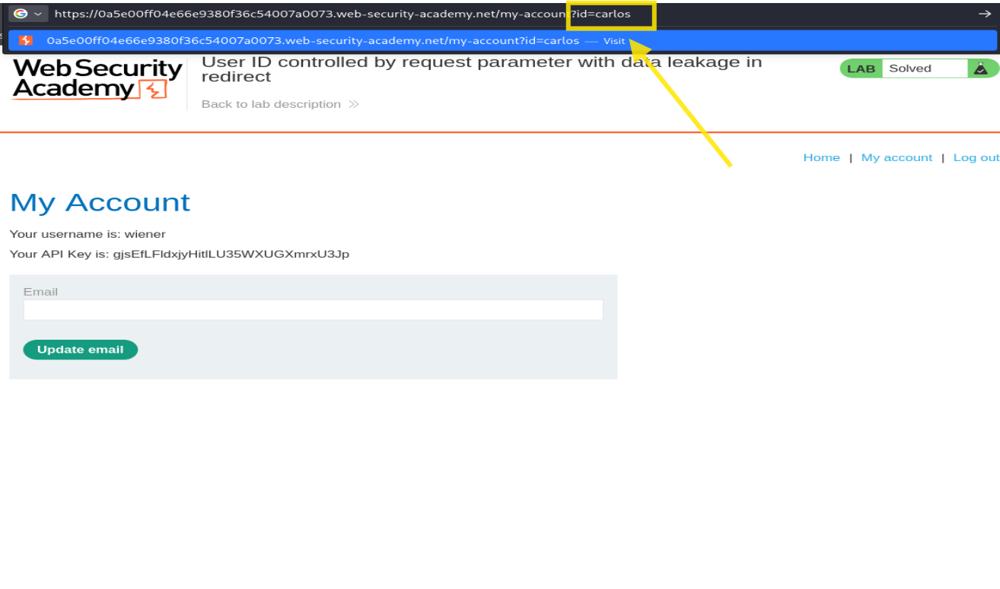
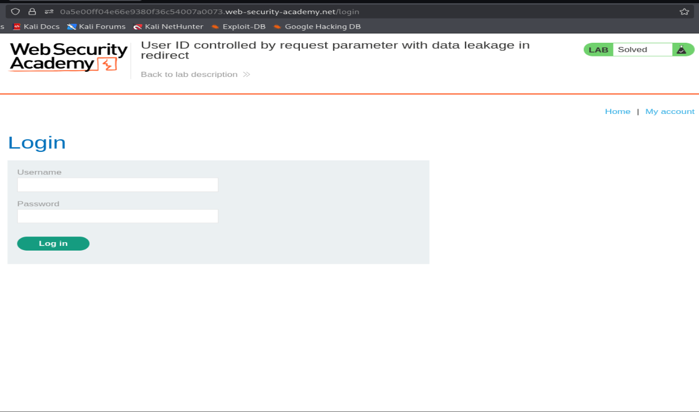
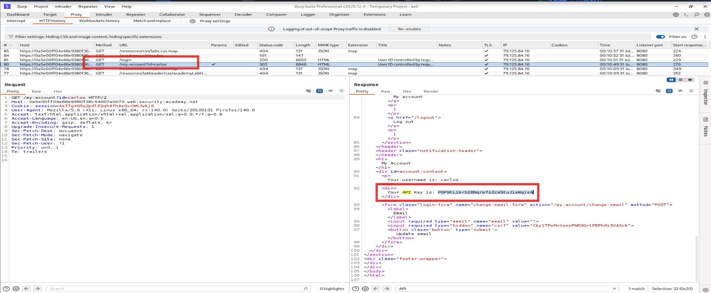
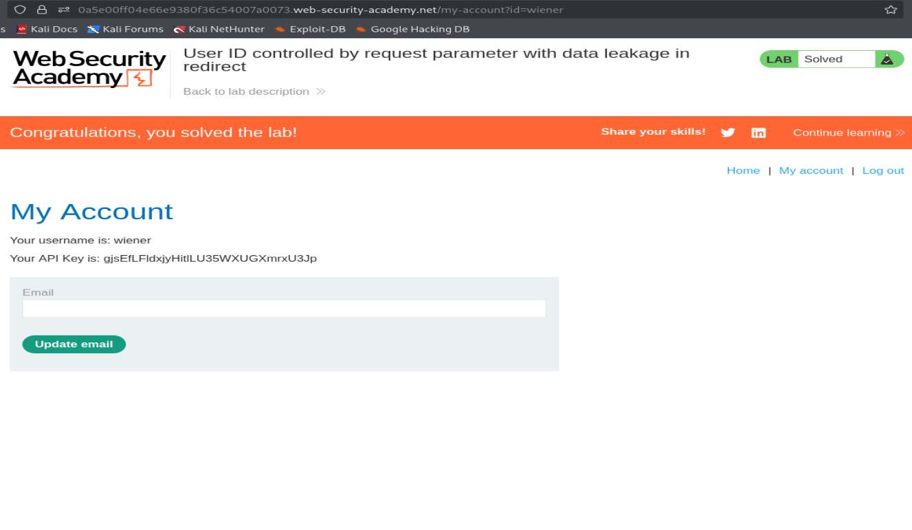

# PortSwigger Lab Writeup: User ID Controlled by Request Parameter with Data Leakage in Redirect

**Category:** Broken Access Control (IDOR)  
**Difficulty:** Practitioner  

---

## What's the Bug?

The account page loads user data based on an id parameter in the URL, like my-account?id=wiener. The app tries to protect itself: if you try to view someone else's id, it redirects you to the login page. In the browser this looks safe — you never see the other user's data. But the redirect isn't as clean as it looks: the server actually sends back the victim's full account page in the same response that triggers the redirect. A browser just follows the redirect and hides that body from you — but a proxy like Burp shows the raw response, data leak and all.

---

## Step 1 — Browse the Site

Started at the shop homepage.

---

## Step 2 — Log In

Logged in as `wiener:peter`.

---

## Step 3 — Check My Own Account

My account page shows my own username and API key, with `id=wiener` in the URL.

---

## Step 4 — Try Someone Else's ID

Edited the URL to `my-account?id=carlos`.

---

## Step 5 — Browser Gets Redirected

The browser bounces straight to `/login` with an empty form — looks like the app blocked access.

---

## Step 6 — Inspect the Raw Response in Burp

Checked the same request in Burp's HTTP history. The response status is `302` (redirect), but the **response body itself still contains the full account page HTML** — including carlos's username and his API key — before the browser ever processes the redirect.

---

## Step 7 — Submit the Leaked API Key

Copied carlos's API key from the raw response and submitted it as the solution. Lab solved.

---

## Why This Happens

The redirect was added as a fix, but it's only a **front-end-level** fix — the server still generates and sends the full, unauthorized page content in the response body before telling the browser to redirect. Since browsers don't show you the body of a redirected response, this looks safe on the surface. But anyone intercepting traffic (Burp, curl, etc.) can just read the leaked data directly, ignoring the redirect entirely.

## How to Fix It

- Never generate a sensitive response body for a request that should be denied — check authorization **before** building the response, not after.
- A redirect is not an access control — the server must refuse to fetch or render the data at all if the user isn't authorized.
- Assume attackers don't follow redirects like a browser does; they read raw responses.
