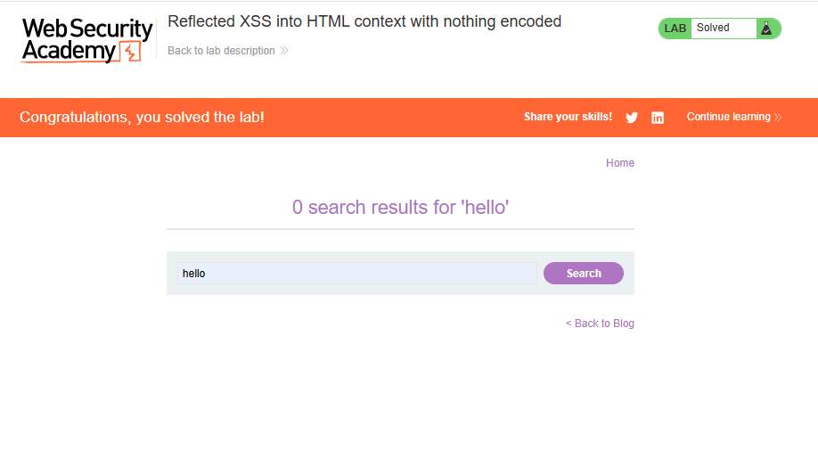
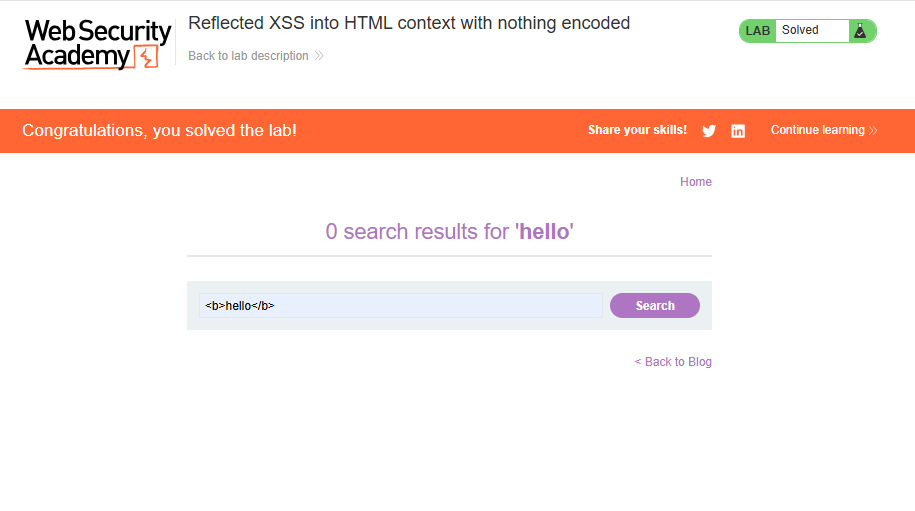
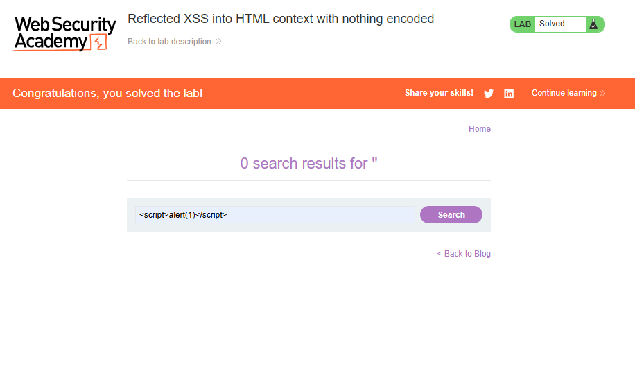
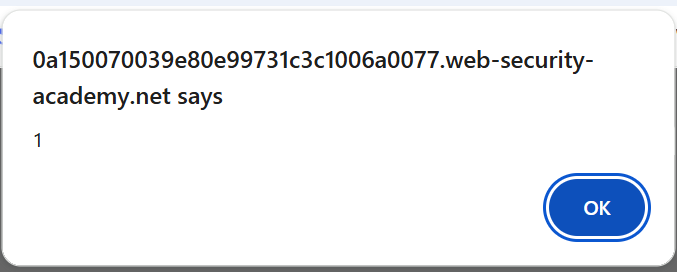

# Lab: Reflected XSS into HTML context with nothing encoded

## 🎯 Objective

Exploit a reflected Cross-Site Scripting (XSS) vulnerability where user input is returned in the HTML response without any encoding or sanitization.

---

## 🌐 Application Overview

The application provides a search feature that reflects user input directly back into the page.


---

## 🔍 Recon

I identified a search input field where the application displays whatever the user enters.

To confirm this behavior, I entered:

```html
hello
```

The input was reflected directly in the response.



---

## 🧪 Testing Input Handling

Next, I tested whether the application filters or encodes HTML tags.

Input used:

```html
<b>hello</b>
```

The application rendered the text in bold, confirming that HTML tags are not being filtered or encoded.



---

## 💥 Exploitation

Since the application does not sanitize user input, I attempted to inject JavaScript.

Payload used:

```html
<script>alert()</script>
```

The payload executed successfully, triggering a JavaScript alert.



---

## 📸 Proof of Exploit

The alert box confirms that arbitrary JavaScript execution is possible in the browser.

 