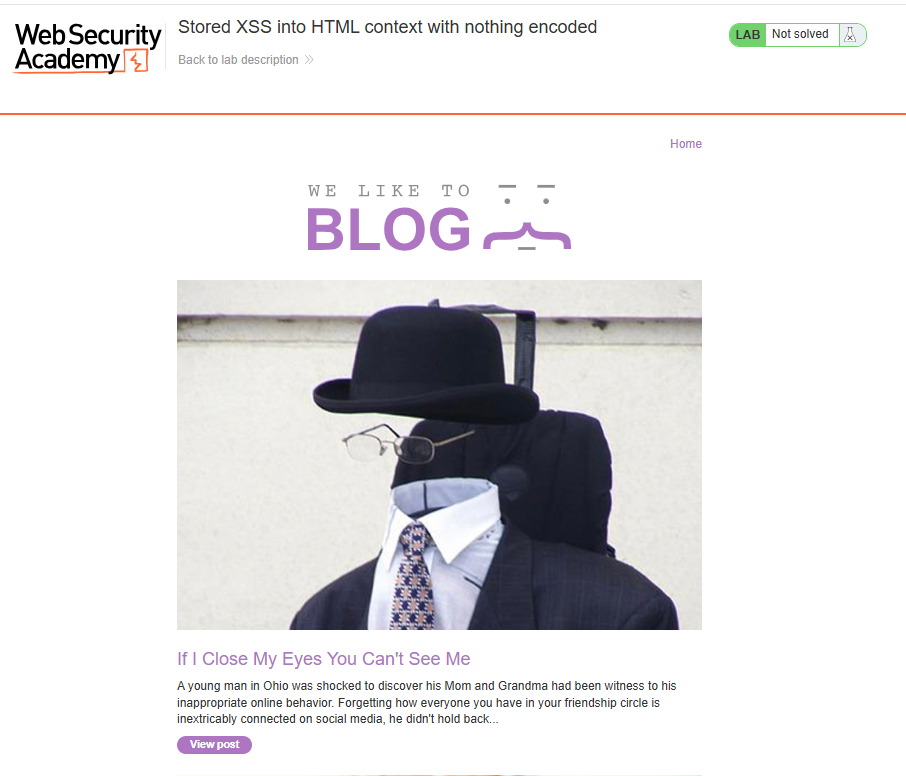
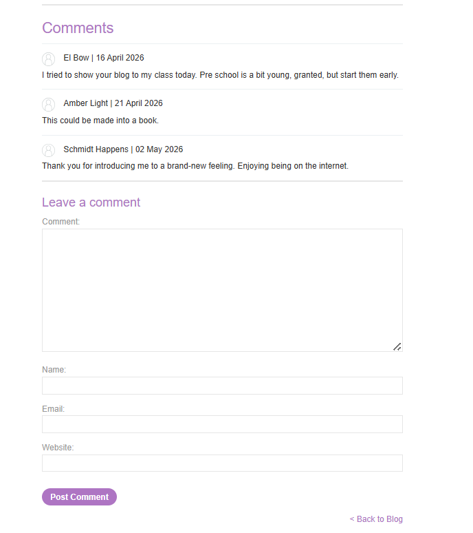
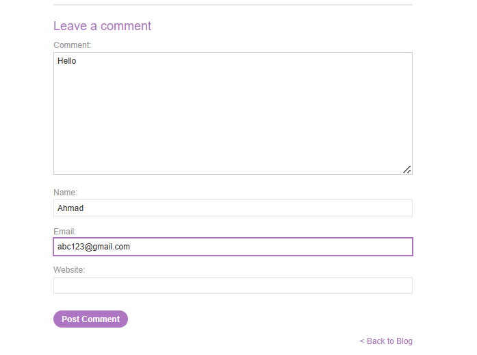
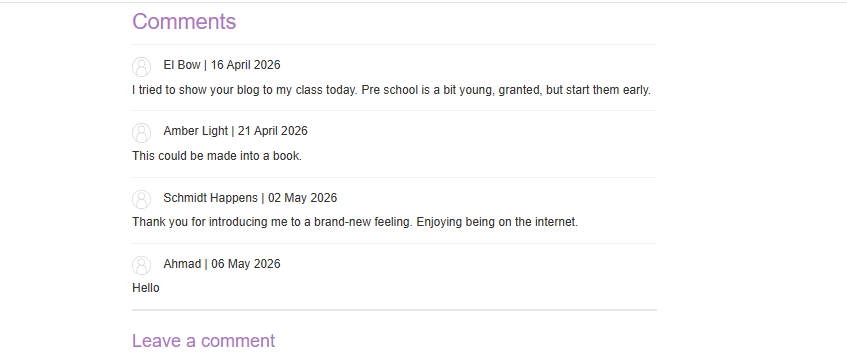
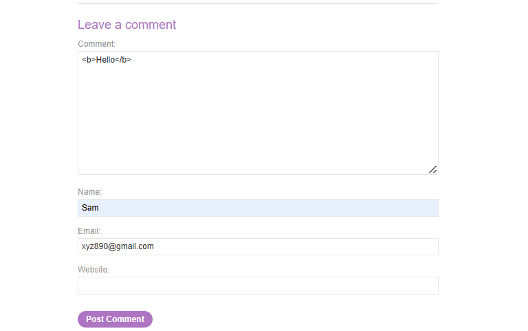
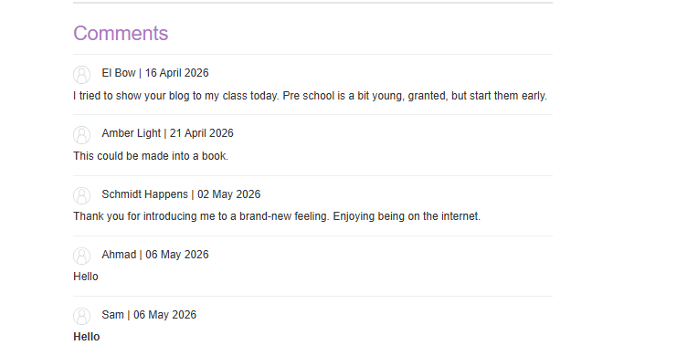
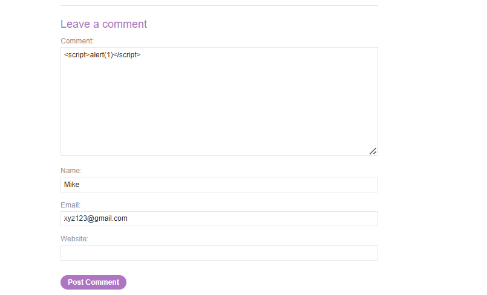
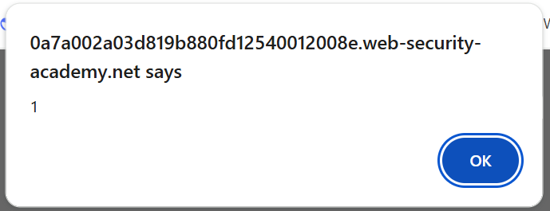

# Lab: Stored XSS into HTML context with nothing encoded

## 🎯 Objective

Exploit a stored Cross-Site Scripting (XSS) vulnerability where user input is stored by the application and later rendered in the HTML response without any encoding or sanitization.

---

## 🌐 Application Overview

The application contains a blog where users can read posts and leave comments.



Navigating into a blog post:


At the bottom, there is a comment section where users can submit input.



---

## 🔍 Recon

I identified that the comment section allows users to submit input which is later displayed on the page.

To confirm this behavior, I posted a normal comment:

hello



The comment was successfully stored and displayed:



---

## 🧪 Testing Input Handling

Next, I tested whether the application filters or encodes HTML tags.

Input used:

```html
<b>hello</b>
```



The application rendered the text in bold, confirming that HTML tags are not being filtered or encoded.



---

## 💥 Exploitation

Since the application does not sanitize user input, I attempted to inject JavaScript into the comment.

Payload used:

```html
<script>alert(1)</script>
```



---

## 📸 Proof of Exploit

After submitting the payload, the script was stored and executed when the page loaded, triggering a JavaScript alert.



---

