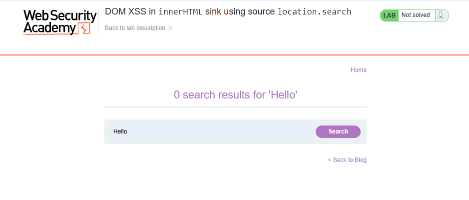
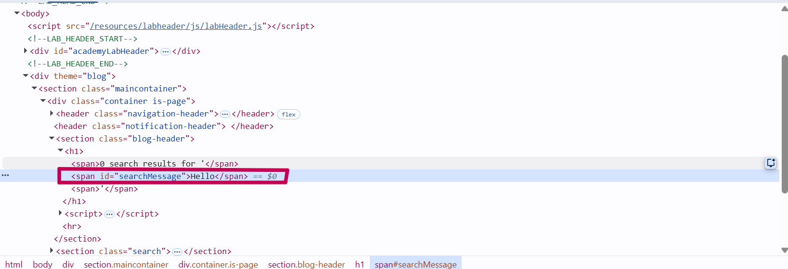
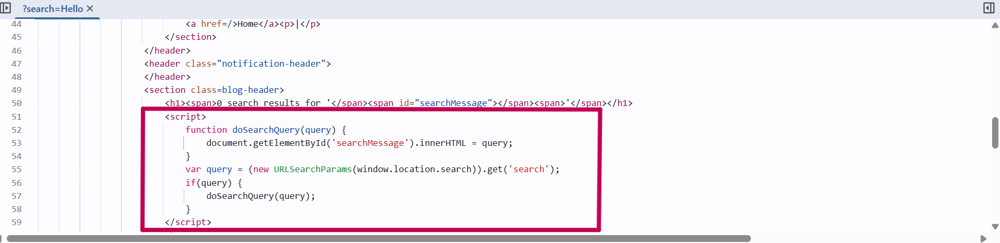
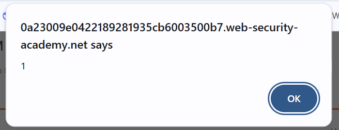

# Lab: DOM XSS in innerHTML sink using source location.search

## 🎯 Objective

Exploit a DOM based Vulenariblity where user input is taken from a source `location.seach` and written directly into DOM using a sing `innerHTML`.

## 🌐 Application Overview

Application contain a search bar for navigating to a specific blog post.

---

## 🔍 Recon

I intered simple hello word to see what happens.

- OBSERVATION : Input is displayed on the screen.

---

## 🔎 Inspection

By inspect Element it can be seen that the input is placed within `ID "searchMessage"`.

Now looking for the Code in the source Tab that handles the input.

- OBSERVATION : Application takes the input from `location.search` and put it inside `id "searchMessage"`.

---

## 💥 Exploit

Trying to craft a javaScript payload to see whether input is sanitized or not.

payload used ``

---

## 📸 Proof of Exploit

After the payload is injected, pop up appeared so it doesn't sanitized the input.

