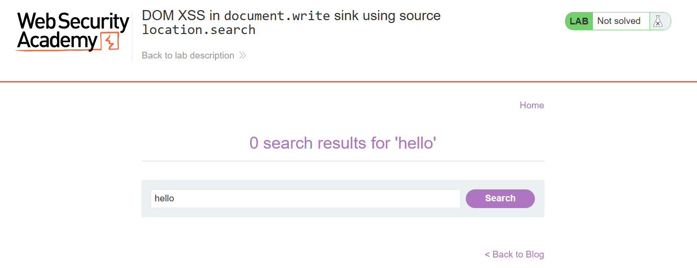
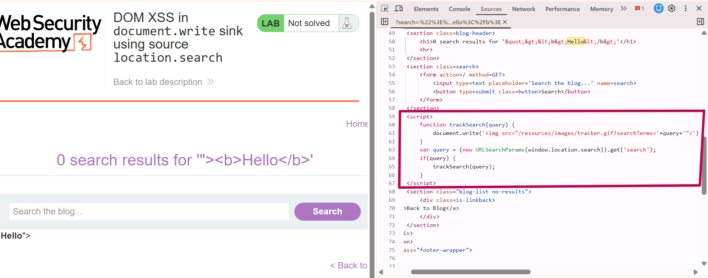
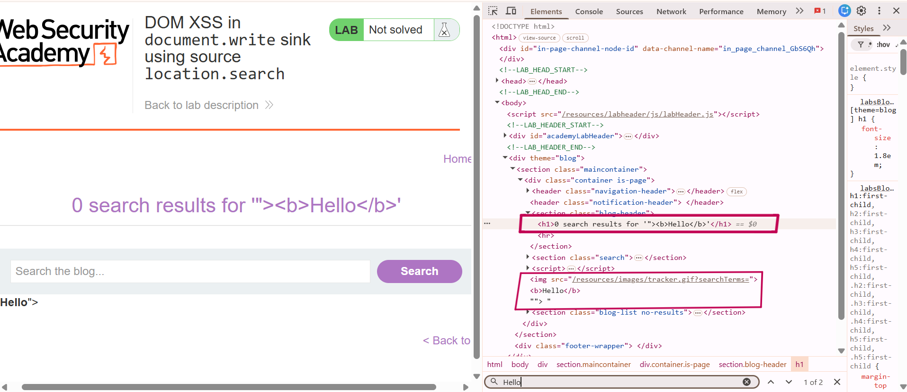
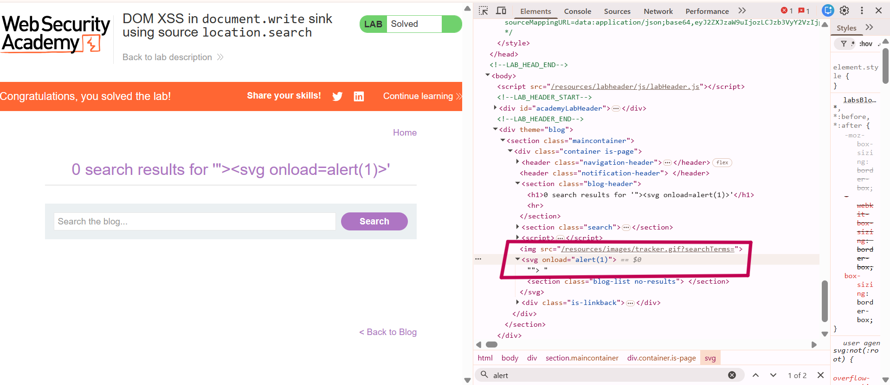
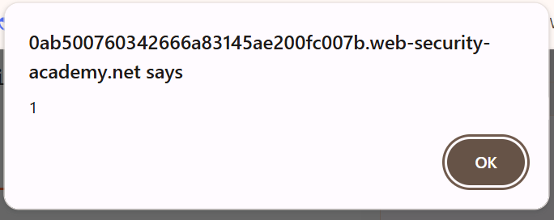

# DOM XSS in document.write Sink Using location.search

## 🎯 Objective

Exploit a DOM based Vulenariblity where user input is taken from a source `location.seach` and written directly into DOM using a sing `document.write`.

---

## 🌐 Application Overview

Application contain a search bar for navigating to a specific blog post.


---

## 🔍 Recon

I intered simple hello word to see what happens.



- OBSERVATION : Input is returned from the server and displayed on the screen, Also written into DOM by Javascript.

## 🧪 Testing Input Handling

I tried another input with b tag, to see how it react to HTML tag.

Input used

```html
"><b>Hello</b>
```


- "> is to breakout of the src attribute you will further see in this write up.

---

## 🔎 Inspection

Source View



- This is a vulnerable Source Code in the image that take user input from the ``` location.search ``` source and write it inside the <b> src attribute </b>``` using ``` document.write ``` sink

DOM view



### Here you will notice Two things 
- (1) Input is displayed in the h1 tag which is encoded by the server and is not dangerous(not executable) in this context.
- (2) Where as in the second rectangle you will see that user input is placed inside the <b>src attribute</b> which broke out using "> and my HTML Tag is parsed.

---

## 💥 Exploit

Now Injecting our payload :

```html
"><svg onload=alert(1)>
```



---

## 📸 Proof of Exploit

After the payload is injected see a pop up shown on the screen.


